# Design Doc: Medical Agent Flow (`create_med_agent_flow`)

> Please DON'T remove notes for AI

## Requirements

> Notes for AI: Keep it simple and clear.
> If the requirements are abstract, write concrete user stories

The medical agent flow serves as a multi-agent system for handling general medical consultations across various healthcare roles (patient_diabetes, patient_hypertension, etc.). The system must:

1. **User Story**: As a patient with diabetes, I want to ask medical questions and receive accurate, role-appropriate responses with follow-up suggestions.
2. **User Story**: As a user, I want the system to gracefully handle casual conversation and greetings while maintaining medical context.
3. **User Story**: As a user, I want the system to remain functional even when AI APIs are overloaded, providing fallback responses from the knowledge base.
4. **User Story**: As a user, I want clarification when my question is unclear or lacks sufficient context for a medical response.

## Flow Design

> Notes for AI:
> 1. Consider the design patterns of agent, map-reduce, rag, and workflow. Apply them if they fit.
> 2. Present a concise, high-level description of the workflow.

### Applicable Design Pattern:

1. **Agent Pattern**: The `MainDecisionAgent` acts as an intelligent router, making dynamic decisions based on input classification
2. **RAG Pattern**: `RetrieveFromKB` → `ScoreDecisionNode` → `ComposeAnswer` implements retrieval-augmented generation
3. **Workflow Pattern**: The entire flow represents a complex medical consultation workflow with branching logic
4. **Graceful Degradation**: Multiple fallback mechanisms ensure system reliability

### Flow High-level Design:

1. **IngestQuery**: Standardizes input processing and role validation
2. **MainDecisionAgent**: Intelligent LLM-based classification of user input types
3. **RetrieveFromKB**: Sequential knowledge base retrieval using user query + RAG questions  
4. **ScoreDecisionNode**: Quality-based routing decision using retrieval confidence scores
5. **ComposeAnswer**: Medical response generation with structured output
6. **ClarifyQuestionNode**: Handles low-confidence scenarios with clarification requests
7. **ChitChatRespond**: Non-medical conversation handling
8. **FallbackNode**: Robust API overload handling with direct KB lookup

```mermaid
flowchart TD
    IngestQuery[IngestQuery<br/>📝 Input Processing] 
    MainDecision[MainDecisionAgent<br/>🧠 Classification]
    RetrieveKB[RetrieveFromKB<br/>📚 Knowledge Retrieval]
    ScoreDecision[ScoreDecisionNode<br/>⚖️ Quality Assessment]
    ComposeAnswer[ComposeAnswer<br/>✍️ Response Generation]
    ClarifyQuestion[ClarifyQuestionNode<br/>❓ Clarification]
    ChitChat[ChitChatRespond<br/>💬 Casual Conversation]
    Fallback[FallbackNode<br/>🔄 Fallback Handling]

    IngestQuery --> MainDecision
    MainDecision -- "retrieve_kb" --> RetrieveKB
    MainDecision -- "chitchat" --> ChitChat
    MainDecision -- "fallback" --> Fallback
    RetrieveKB --> ScoreDecision
    ScoreDecision -- "compose_answer" --> ComposeAnswer
    ScoreDecision -- "clarify" --> ClarifyQuestion
    ComposeAnswer -- "fallback" --> Fallback
    ChitChat -- "fallback" --> Fallback
```



## Utility Functions

> Notes for AI:
> 1. Understand the utility function definition thoroughly by reviewing the doc.
> 2. Include only the necessary utility functions, based on nodes in the flow.

1. **Call LLM** (`utils/call_llm.py`)
   - *Input*: prompt (str), optional fast_mode (bool)
   - *Output*: response (str)
   - Used by MainDecisionAgent, ComposeAnswer, and ChitChatRespond for LLM operations
   - Handles APIOverloadException for graceful degradation

2. **Knowledge Base Retrieval** (`utils/kb.py`)
   - *Input*: query (str), role (str), top_k (int)
   - *Output*: (results: List[Dict], best_score: float)
   - Used by RetrieveFromKB and FallbackNode for semantic search

3. **Response Parser** (`utils/response_parser.py`)
   - *Input*: yaml_text (str), required_fields (List), field_types (Dict)
   - *Output*: parsed_dict (Dict)
   - Used by MainDecisionAgent and ComposeAnswer for structured LLM output parsing

4. **Format Helpers** (`utils/helpers.py`)
   - *Input*: Various formatting inputs (QA lists, conversation history)
   - *Output*: Formatted strings for prompts
   - Used across multiple nodes for consistent data presentation

## Node Design

### Shared Store

> Notes for AI: Try to minimize data redundancy

The shared store structure is organized as follows:

```python
shared = {
    # Input data
    "input": str,                    # Raw user input
    "role": str,                     # User's medical role
    "conversation_history": List[Dict],  # Previous conversation context
    
    # Processing data
    "query": str,                    # Processed/cleaned query
    "input_type": str,              # Classification result (medical_question, chitchat, etc.)
    "classification_confidence": str, # LLM confidence level
    "classification_reason": str,    # Reason for classification
    "rag_questions": List[str],     # Generated questions for enhanced retrieval
    
    # Retrieval data
    "retrieved": List[Dict],        # Knowledge base results
    "retrieval_score": float,       # Best retrieval score
    "need_clarify": bool,          # Whether clarification is needed
    
    # Output data
    "answer_obj": Dict,            # Complete response object
    "explain": str,                # Main explanation text
    "suggestion_questions": List[str], # Follow-up question suggestions
    "response_context": str        # Context for response generation
}
```

### Node Steps

> Notes for AI: Carefully decide whether to use Batch/Async Node/Flow.

1. **IngestQuery Node**
   - *Purpose*: Standardize input processing and extract role/query information
   - *Type*: Regular Node
   - *Steps*:
     - *prep*: Read "input" and "role" from shared store
     - *exec*: Process and validate input data, create structured result
     - *post*: Write "role" and "query" to shared store

2. **MainDecisionAgent Node**
   - *Purpose*: Intelligent classification of user input using LLM
   - *Type*: Regular Node with retry mechanism
   - *Steps*:
     - *prep*: Read "query", "role", and "conversation_history" from shared store
     - *exec*: Call LLM for input classification with structured output
     - *post*: Write classification results and route based on input type

3. **RetrieveFromKB Node**
   - *Purpose*: Sequential knowledge base retrieval with deduplication
   - *Type*: Regular Node
   - *Steps*:
     - *prep*: Read "query" and "rag_questions" from shared store
     - *exec*: Perform sequential retrieval, deduplicate results, select top 5
     - *post*: Write "retrieved" and "retrieval_score" to shared store

4. **ScoreDecisionNode**
   - *Purpose*: Quality-based routing decision using retrieval scores
   - *Type*: Regular Node (no LLM calls)
   - *Steps*:
     - *prep*: Read "input_type" and "retrieval_score" from shared store
     - *exec*: Compare score against threshold, determine action
     - *post*: Write "response_context" and return routing action

5. **ComposeAnswer Node**
   - *Purpose*: Generate comprehensive medical responses with suggestions
   - *Type*: Regular Node with fallback handling
   - *Steps*:
     - *prep*: Read role, query, retrieved results, and conversation history
     - *exec*: Call LLM for structured response generation with persona
     - *post*: Write answer object, handle API overload routing

6. **ClarifyQuestionNode**
   - *Purpose*: Handle low-score scenarios with clarification requests
   - *Type*: Regular Node (no LLM calls)
   - *Steps*:
     - *prep*: Read role, query, and retrieved results
     - *exec*: Generate clarification message and suggestion questions
     - *post*: Write clarification response to shared store

7. **ChitChatRespond Node**
   - *Purpose*: Handle non-medical conversation with role-appropriate persona
   - *Type*: Regular Node with fallback handling
   - *Steps*:
     - *prep*: Read role, query, and conversation history
     - *exec*: Call LLM for casual conversation response
     - *post*: Write response, handle API overload routing

8. **FallbackNode**
   - *Purpose*: Robust fallback mechanism for API overload scenarios
   - *Type*: Regular Node (no LLM calls)
   - *Steps*:
     - *prep*: Read query, role, and rag_questions
     - *exec*: Direct knowledge base lookup with exact matching and retrieval
     - *post*: Write fallback response with appropriate suggestions
