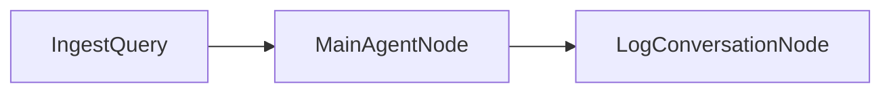
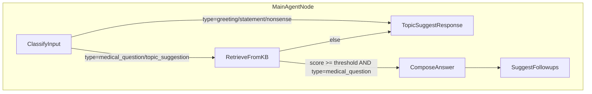

## Medical Agent Flow (Current)

This document describes the current execution flow of nodes in the project. The top-level flow is a simple linear pipeline, while the core decision-making happens inside `MainAgentNode`.

### Top-level Flow

- `IngestQuery`: Reads `role` and raw `input` from the shared store, normalizes them, and stores `query`.
- `MainAgentNode`: Central orchestrator that classifies the input, retrieves knowledge if needed, composes the final answer or topic suggestions, and produces follow-up suggestions when applicable.
- `LogConversationNode`: Logs the final user query and bot answer to `conversation.log`.

### MainAgentNode Internal Logic

- `ClassifyInput`:
  - Reads `query` and `role`.
  - Uses lightweight pattern-based classification first; falls back to LLM with schema validation.
  - Sets `shared["input_type"]` and routes logic.

- `RetrieveFromKB`:
  - Retrieves top-K KB entries with a similarity `score`.
  - Writes `shared["retrieved"]`, `shared["retrieval_score"]`, and `shared["need_clarify"]`.

- Routing decision (inside `MainAgentNode`):
  - If `input_type` ∈ {greeting, statement, nonsense} → go to `TopicSuggestResponse` with context-dependent intro.
  - If `input_type` = medical_question:
    - If `score >= threshold` → `ComposeAnswer` then `SuggestFollowups`.
    - Else → `TopicSuggestResponse` (context: low score).
  - If `input_type` = topic_suggestion → `TopicSuggestResponse`.

- `ComposeAnswer`:
  - Builds KB context, then prompts LLM to produce a detailed answer.
  - Stores structured `answer_obj` and `answer` (`final` text) in shared store.

- `SuggestFollowups`:
  - Generates up to 3 follow-up questions based on query, history, answer text, and KB context.
  - Writes `shared["suggestions"]`.

- `TopicSuggestResponse`:
  - Produces an intro tailored to context (`greeting`, `statement`, `nonsense`, or low-score medical) and a bulleted topic list for the current role.
  - Writes `shared["answer"]` and the first 3 topics to `shared["suggestions"]`.

### Data Written to Shared Store

- Keys commonly used:
  - `role`, `input`, `query`, `history`
  - `input_type`, `response_context`
  - `retrieved`, `retrieval_score`, `need_clarify`
  - `answer_obj`, `answer`, `suggestions`
  - `conversation_logged`

### Notes

- The API layer (`/api/chat`) consumes `answer`, `suggestions`, and `input_type`. Parsing/structuring of the response (explanation, summary, question suggestions) happens via the response parser utilities.

