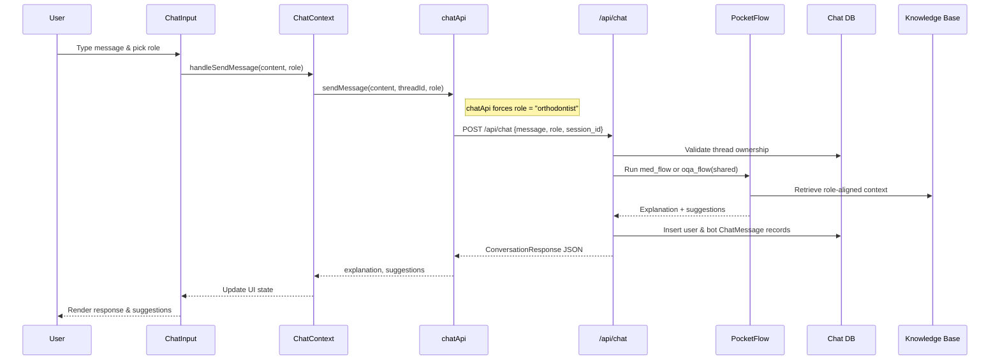
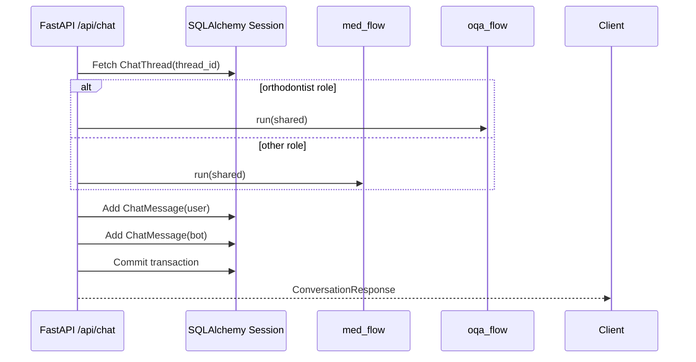
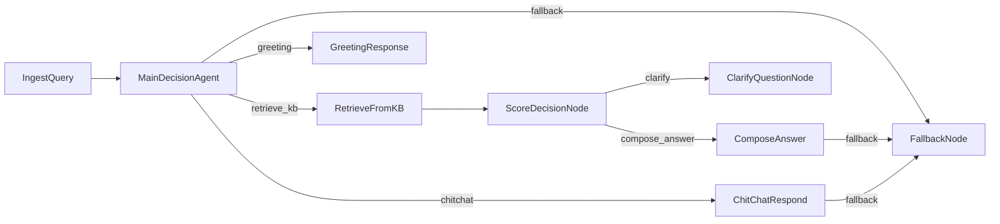
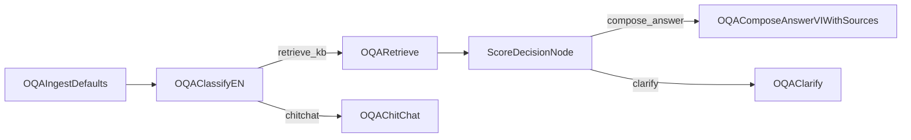

# Chatbot System Flow Guide

This document visualizes how the chatbot-rhm frontend and backend coordinate to handle chat conversations.

## High-Level Architecture

```mermaid
graph TD
    U[End User] -->|messages & role pick| UI[Next.js UI\n(chatbot-rhm-ui)]
    UI -->|REST calls via chatApi| API[FastAPI backend\n(chatbot-rhm-api)]
    API -->|runs| Flows[PocketFlow pipelines]
    Flows -->|vector search| KB[Role-aware Knowledge Base]
    API -->|persist chat history| DB[(PostgreSQL)]
    API -->|responses| UI
```

- `chatbot-rhm-ui` renders the chat interface and orchestrates API access through `lib/chat-context.tsx` and `lib/chat-api.js`.
- `chatbot-rhm-api` exposes REST routes (`api.py`) that wrap PocketFlow pipelines defined in `flow.py` and `OQA_nodes.py`.
- The backend stores threads/messages in the database and queries role-specific CSV knowledge bases via `utils/kb.py`.

## Frontend Message Lifecycle



Key frontend touchpoints:
- `ChatInput` notifies `Chat` via `onRoleChange`, updating background aesthetics (`chatbot-rhm-ui/app/dashboard/components/chat-input.tsx`, `chatbot-rhm-ui/app/dashboard/components/chat.tsx`).
- `ChatMessages` chooses between dental and endocrine imagery based on the selected role (`chatbot-rhm-ui/app/dashboard/components/chat-messages.tsx`).
- `chatApi` always submits the orthodontist persona to the backend (`chatbot-rhm-ui/lib/chat-api.js`).

## Backend Request Handling



Highlights from `chatbot-rhm-api/api.py`:
- Incoming requests default to `orthodontist` (`ConversationRequest.role`).
- The handler overrides any client-provided role to `orthodontist` before invoking flows.
- Responses include explanation text, follow-up suggestions, and flags such as `need_clarify`.

## PocketFlow Pipelines

### Medical Agent (general roles)



### Orthodontist OQA Agent



The OQA flow is optimized for orthodontist knowledge: classification decides between retrieval and chit-chat, and there is no fallback node because the pipeline is streamlined for a single specialty dataset.

## Data Storage Touchpoints

- Threads and messages persist through SQLAlchemy models (`database/models.py`), with each API call inserting both user and bot messages.
- Knowledge base lookups use TF-IDF matrices cached per role (`utils/kb.py`).

Use these diagrams as a starting point when onboarding new contributors or discussing changes to the conversation pipeline.
